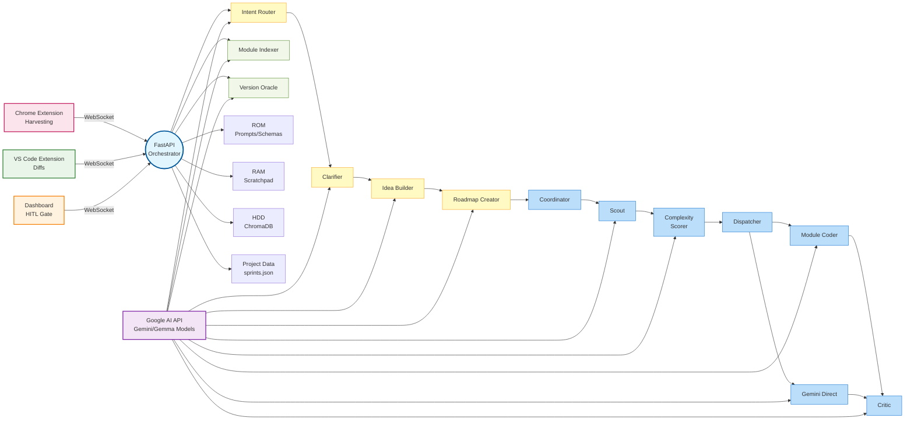

# D0mmy — Autonomous Multi-Agent Engineering System

[](#roadmap)
[](#)
[](https://www.python.org/)

**D0mmy** is an autonomous, offline-first multi-agent engineering system. Designed not as a chat wrapper, but as a "factory floor," D0mmy orchestrates specialized AI agents to handle planning, coding, hardware debugging, and documentation within a deterministic pipeline.

---

## 🏗️ Architecture Overview

D0mmy connects your browser, your code editor, and a powerful agentic backend into a unified engineering environment. The system operates through deterministic pipelines with specialized AI agents handling planning, coding, hardware debugging, and documentation.



## ✨ Key Features

- **Autonomous Engineering**: AI agents handle planning, coding, and debugging without human micro-management
- **Deterministic Pipelines**: Reproducible AI behavior through immutable prompts and structured data flow
- **Multi-Modal Context**: Combines repository analysis, web research, and harvested documentation
- **Human-in-the-Loop**: Developer approval gates with interrupt capability for course correction
- **Hardware-Aware**: BOM validation and serial I/O integration for embedded development
- **Version Oracle**: Anti-hallucination system ensuring accurate model and library references
- **Offline-First**: Local operation with optional Google AI integration
- **Extensible Architecture**: Plugin system for custom agents and integrations

---

## 🛠️ Tech Stack

| Layer | Technology | Version/Model |
|---|---|---|
| **Orchestrator** | Python 3.12, FastAPI, Uvicorn | fastapi>=0.115, uvicorn>=0.30 |
| **AI Models** | Google AI (google-genai) | v1.73.1+ |
| | Heavy Synthesis | `gemini-3.1-pro-preview` |
| | Worker Agents | `gemma-4-31b-it` |
| | Daemon/Router | `gemma-4-26b-a4b-it` |
| | Embeddings | `gemini-embedding-001` |
| **Memory** | ChromaDB (Vector DB) | chromadb>=0.5 |
| | Pydantic Settings | pydantic>=2.7, pydantic-settings>=2.3 |
| **Dashboard** | Vite + React + TypeScript | react@^18.3.1, @xyflow/react@^12.0.0 |
| | Terminal | @xterm/xterm@^5.5.0, xterm-addons |
| | Graph Visualization | dagre@^0.8.5 |
| **Editor Bridge** | VS Code Extension (TypeScript) | vscode@^1.90.0, ws@^8.17.1 |
| **Browser Harvesting** | Chrome Extension (Manifest V3) | Service Worker API |
| **Hardware I/O** | PySerial | pyserial>=3.5 (hardware+software mode) |
| **Build Tools** | uv (Python), npm | Python packaging via hatchling |
| **Development** | pytest, TypeScript | pytest>=8, typescript@^5.4.5 |

---

## 🧩 Components

### 🧠 FastAPI Orchestrator
The central nervous system managing the event bus, agent lifecycle, and deterministic memory layers. Routes messages between browser, dashboard, and editor clients.

**Key Features:**
- Bidirectional WebSocket hub at `/ws/{client_type}/{client_id}`
- Connection registry with client type tracking and keepalive (25s ping, 10s timeout)
- JSON envelope protocol with session tracking
- REST APIs for settings, indexing, and terminal management

### 🧠 AI Agent System
Specialized agents handle different aspects of the engineering pipeline:

**Planning Pipeline:**
- **Intent Router** (Gemma 4 26B): Classifies user intents as hardware/software/mixed
- **Clarifier** (Gemma 4 26B): Generates targeted clarifying questions based on project context
- **Idea Builder** (Parallel Gemma 4 31B): Tech Harvester (ChromaDB + web research), Risk Assassin (failure analysis), Rubric Aligner (BOM constraints)
- **Roadmap Creator**: Time Estimator + Intersection Architect build executable DAG sprints
- **Coordinator** (Dynamic Agents): Executes approved sprints with real-time status updates

**Execution Pipeline:**
- **Scout**: Parallel repo search (ChromaDB + module index) + web research for task context
- **Complexity Scorer** (Gemma 4 26B): Rates task difficulty 0-10 for routing decisions
- **Dispatcher**: Tiered routing - Gemma workers → Gemini escalation for complex tasks
- **Coder Agents**: Module Coder (surgical edits), Gemini Direct (complex tasks), Critic (review + BOM validation)
- **Retriever**: Context loading from module index with file size caps

**Indexing System:**
- **Module Indexer**: AST parsing + AI summarization for context pyramid
- **File Summarizer** (Gemma 4 31B): TLDR + markdown trees for each file
- **Module Grouper** (Gemma 4 31B): Logical grouping using import graphs

**Infrastructure:**
- **Version Oracle**: Anti-hallucination system with Google Search grounding
- **Version Hook**: Pre-generation injection of verified references
- **Memory Layers**: ROM (immutable prompts/schemas), RAM (5-turn scratchpad), HDD (ChromaDB vector store)

### 📊 Vite Dashboard
Premium React-based UI for visualizing and controlling the engineering pipeline.

**Components:**
- **SprintGraph** (@xyflow/react + dagre): Interactive DAG with color-coded nodes (task=blue, hard_stop=crimson, milestone=green, interrupted=orange)
- **ControlPanel**: Intent input, interrupt injection, Version Oracle UI
- **Settings**: 4-tab interface (API keys, Models, Server, Hardware/BOM)
- **TerminalPanel** (xterm.js): Live streaming of backend logs with quick-launch buttons
- **ClarificationPanel**: Dynamic question forms for intent clarification

### 📥 Chrome Harvester
Lightweight Manifest V3 extension for harvesting documentation and research.

**Features:**
- `Ctrl+Shift+S` / `⌘+Shift+S` shortcut triggers selection → HTML → Markdown conversion
- Service worker processes content and sends to ChromaDB via WebSocket
- Content script provides green flash feedback on successful harvest
- Popup shows connectivity status via `/health` endpoint

### 🌉 VS Code Bridge
TypeScript extension providing seamless AI-generated code integration.

**Features:**
- WebSocket client with exponential backoff reconnection
- Inline Diff API integration with Tab/Escape acceptance
- LSP wrapper exposing file paths, cursor positions, workspace tree
- Commands: `d0mmy.acceptDiff`, `d0mmy.rejectDiff`, `d0mmy.sendContext`
- Keybindings: Tab (accept), Escape (reject) when diff pending

### 💾 Memory Architecture
Three-layer deterministic memory system ensuring reproducible AI behavior:

- **ROM**: Immutable prompts (`prompts/*.md`) and schemas (`schemas/*.json`) loaded at startup
- **RAM**: 5-turn conversation scratchpad with automatic daemon truncation
- **HDD**: ChromaDB vector store for harvested context with Google embeddings

### 🔧 Project Modes
Configurable operation modes controlled via dashboard Settings:

- **Software Mode**: Standard development pipeline
- **Hardware+Software Mode**: Includes BOM validation, rubric alignment, risk assessment, and serial daemon activation

---

## 🚀 Quickstart

### Prerequisites
- Python 3.12+
- Node.js & npm
- [uv](https://github.com/astral-sh/uv) (recommended)

### Setup
1. **Clone the repository and install dependencies:**
   ```bash
   uv sync
   ```

2. **Configure Environment:**
   ```bash
   python scripts/setup_keys.py
   ```
   *Note: Requires a Google AI API Key.*

3. **Launch the System:**
   D0mmy includes a unified bootstrapper to start all processes:
   ```bash
   python dev.py
   ```
   This will start:
   - **Backend**: http://localhost:8000
   - **Launcher**: http://localhost:8001
   - **Dashboard**: http://localhost:5173

4. **Install Extensions:**
   - **Chrome**: Load `extension/` as an unpacked extension in `chrome://extensions`.
   - **VS Code**: Install `vscode-extension/d0mmy-vscode-0.1.0.vsix` via "Extensions: Install from VSIX" command, or sideload the source in `vscode-extension/`.

### Data & Configuration
D0mmy creates several data files during operation:
- `.d0mmy/chroma/`: ChromaDB vector database for harvested context
- `data/module_index.json`: Machine-readable module index
- `data/module_index.md`: Human-readable module index
- `data/sprints.json`: Current sprint plan
- `data/bom.json`: Hardware bill of materials (hardware+software mode)

Configuration is managed via `.env` file (created by `setup_keys.py`).

### Multi-Project Support
D0mmy supports running multiple projects simultaneously on separate ports:

```bash
# Attach D0mmy to an existing repository
python scripts/attach.py /path/to/your/repo

# Or use the project manager for advanced multi-repo setups
python scripts/projects.py add myproject /path/to/repo --port 8010
python scripts/projects.py start myproject
```

Each project gets isolated data storage and can run independently.

---

## 🗺️ Roadmap

- [x] **Phase 1**: Central Nervous System (FastAPI, WebSockets, Memory) — **COMPLETE**
- [x] **Phase 2**: Planning Engine (Idea Builder, Roadmap Creator) — **BUILT, pending live verification**
- [x] **Phase 3**: Execution Engine (VS Code Bridge, Coder Pipeline) — **LARGELY COMPLETE** (Module Indexer, Scout, Coder Pipeline, VS Code Extension implemented)
- [ ] **Phase 4**: Hardware Daemons (Serial I/O, Build Automation)
- [ ] **Phase 5**: VSCodium Fork (Native IPC, Integrated Binary)

See [roadmap.md](roadmap.md) for the detailed critical path.

## 📈 Current Status

**Phase 1**: ✅ Complete — Headless orchestrator with WebSocket event bus and deterministic memory layers.

**Phase 2**: 🟡 Built, pending verification — Planning pipeline from intent to sprint graph, with HITL approval.

**Phase 3**: 🟢 Largely Complete — Full execution pipeline implemented including:
- Module Indexer with AST parsing and AI summarization
- Scout agents for context gathering (repo + web search)
- Complexity scoring and tiered coder routing (Gemma → Gemini escalation)
- VS Code extension with Inline Diff API integration
- Execution pipeline with interrupt system

**Next Steps**:
1. Verify Checkpoint 1: Chrome harvest → ChromaDB roundtrip
2. Verify Checkpoint 2: Intent → sprint graph on dashboard  
3. Verify Checkpoint 3: Sprint approval → VS Code diffs → Tab acceptance
4. Begin Phase 4: Hardware daemon implementation
