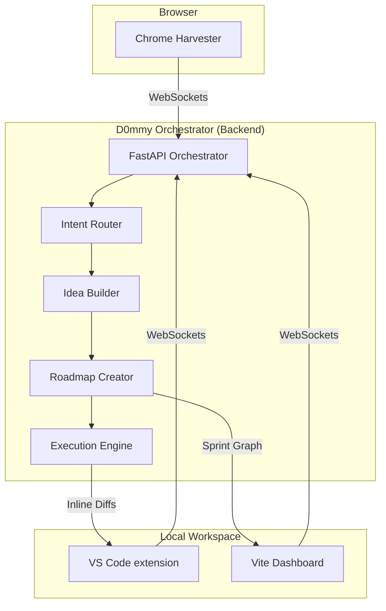

# D0mmy — Autonomous Multi-Agent Engineering System

[](#roadmap)
[](#)
[](https://www.python.org/)

**D0mmy** is an autonomous, offline-first multi-agent engineering system. Designed not as a chat wrapper, but as a "factory floor," D0mmy orchestrates specialized AI agents to handle planning, coding, hardware debugging, and documentation within a deterministic pipeline.

---

## 🏗️ Architecture Overview

D0mmy connects your browser, your code editor, and a powerful agentic backend into a unified engineering environment.



---

## 🛠️ Tech Stack

| Layer | Technology |
|---|---|
| **Orchestrator** | Python 3.12, FastAPI, Uvicorn |
| **Agents** | Gemini 3.1 Pro (Heavy), Gemma 4 (Workers & Daemons) |
| **Memory** | ChromaDB (HDD), Scratchpad (RAM), Locked Prompts/Schemas (ROM) |
| **Dashboard** | Vite, React, @xyflow/react, xterm.js |
| **Editor Bridge** | TypeScript VS Code Extension, LSP |
| **Context Harvesting** | Chrome Extension (Manifest V3) |

---

## 🧩 Components

### 🧠 FastAPI Orchestrator
The central nervous system. It manages the event bus, agent lifecycle, and deterministic memory layers. It ensures that data flows through specialized roles:
- **Intent Router**: Classifies incoming tasks.
- **Idea Builder**: Generates technical blueprints and constraints.
- **Roadmap Creator**: Builds a DAG of executable sprints.
- **Execution Engine**: Drives code changes via the VS Code bridge.

### 📊 Vite Dashboard
A premium React-based UI for visualizing the project roadmap. It features:
- **Sprint Graph**: A color-coded interactive DAG showing task progress.
- **HITL Gate**: Human-In-The-Loop controls for approving sprints and injecting interrupts.
- **Terminal Panel**: Live streaming of backend logs and command execution.

### 📥 Chrome Harvester
A lightweight extension that allows "harvesting" documentation, API refs, or research directly from the web into D0mmy's long-term memory (ChromaDB) with a single shortcut (`⌘+Shift+S`).

### 🌉 VS Code Bridge
A TypeScript extension that receives code diffs from the AI and presents them via the Inline Diff API, allowing developers to review and accept changes with a single `Tab`.

---

## 🚀 Quickstart

### Prerequisites
- Python 3.12+
- Node.js & npm
- [uv](https://github.com/astral-sh/uv) (recommended)

### Setup
1. **Clone the repository and install dependencies:**
   ```bash
   uv sync
   ```

2. **Configure Environment:**
   ```bash
   python scripts/setup_keys.py
   ```
   *Note: Requires a Google AI API Key.*

3. **Launch the System:**
   D0mmy includes a unified bootstrapper to start all processes:
   ```bash
   python dev.py
   ```
   This will start:
   - **Backend**: http://localhost:8000
   - **Launcher**: http://localhost:8001
   - **Dashboard**: http://localhost:5173

4. **Install Extensions:**
   - **Chrome**: Load `extension/` as an unpacked extension in `chrome://extensions`.
   - **VS Code**: Sideload the extension in `vscode-extension/`.

---

## 🗺️ Roadmap

- [x] **Phase 1**: Central Nervous System (FastAPI, WebSockets, Memory) — **COMPLETE**
- [x] **Phase 2**: Planning Engine (Idea Builder, Roadmap Creator) — **BUILT, pending live verification**
- [ ] **Phase 3**: Execution Engine (VS Code Bridge, Coder Pipeline) — **IN PROGRESS** (Module Indexer complete)
- [ ] **Phase 4**: Hardware Daemons (Serial I/O, Build Automation)
- [ ] **Phase 5**: VSCodium Fork (Native IPC, Integrated Binary)

See [roadmap.md](roadmap.md) for the detailed critical path.

## 📈 Current Status

**Phase 1**: ✅ Complete — Headless orchestrator with WebSocket event bus and deterministic memory layers.

**Phase 2**: 🟡 Built, pending verification — Planning pipeline from intent to sprint graph, with HITL approval.

**Next Steps**:
1. Verify Checkpoint 1: Chrome harvest → ChromaDB roundtrip
2. Verify Checkpoint 2: Intent → sprint graph on dashboard
3. Begin Phase 3: Wire execution engine to VS Code extension
